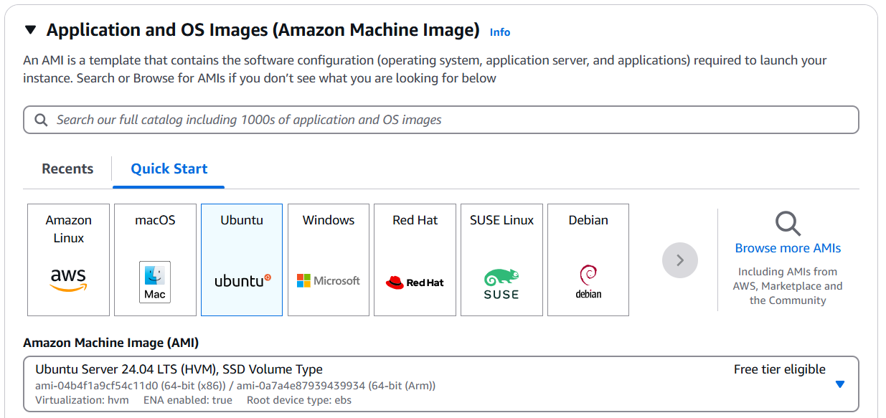
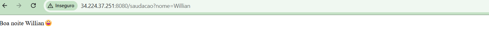

***5 - Descreva como você faria o deploy da API Flask criada anteriormente usando Docker e AWS (EC2 ou Fargate).***

## 1 ° Criar máquina Linux (Ubunto) na AWS.

## 2 ° Conectar na máquina, conexão pode ser feita usando a própria console da AWS ou o PUTTY com a chave .ppk.
    * ubuntu@IP_PUBLICO

## 3° Instalação do docker na VM do EC2:
    * https://docs.docker.com/engine/install/ubuntu/

    sudo apt-get update
    sudo apt-get install ca-certificates curl
    sudo install -m 0755 -d /etc/apt/keyrings
    sudo curl -fsSL https://download.docker.com/linux/ubuntu/gpg -o /etc/apt/keyrings/docker.asc
    sudo chmod a+r /etc/apt/keyrings/docker.asc

    # Add the repository to Apt sources:
    echo \
    "deb [arch=$(dpkg --print-architecture) signed-by=/etc/apt/keyrings/docker.asc] https://download.docker.com/linux/ubuntu \
    $(. /etc/os-release && echo "${UBUNTU_CODENAME:-$VERSION_CODENAME}") stable" | \
    sudo tee /etc/apt/sources.list.d/docker.list > /dev/null
    sudo apt-get update

    sudo apt-get install docker-ce docker-ce-cli containerd.io docker-buildx-plugin docker-compose-plugin

## 4° Criação do container: 

    * https://medium.com/@geeekfa/dockerizing-a-python-flask-app-a-step-by-step-guide-to-containerizing-your-web-application-d0f123159ba2

    docker build -t einsten_test .
    
    #Testando container
        * docker run -p 8080:5000
      

## 5° Subindo container no repositório no Docker hub:

    * https://docs.docker.com/get-started/introduction/build-and-push-first-image/
    
    * docker login
    * docker tag einsten_test willmacedo1/einsten_test
    * docker push willmacedo1/einsten_test

## 6° Deploy container no EC2:
    
    Neste passo o docker já está instalado na VM do EC2 então basta rodar o container que está no docker Hub.

        * https://aws.plainenglish.io/deploy-docker-image-to-aws-ec2-in-5-minutes-4cd7518feacc

    # Comando para executar container, garantindo que ele permaneça mesmo com a máquina reiniciando.

        sudo docker run -d --restart=always -p 8080:5000 --name einsten_test willmacedo1/einsten_test
            -d: segundo plano

    sudo docker ps  # Verifica se container está rodando.

## 7° Liberar trafego na porta 8080 e de todos os endereços IPs caso a aplicação seja publica.

    * Container em produção: 
        * http://ec2-54-227-165-135.compute-1.amazonaws.com:8080/saudacao?nome=teste

